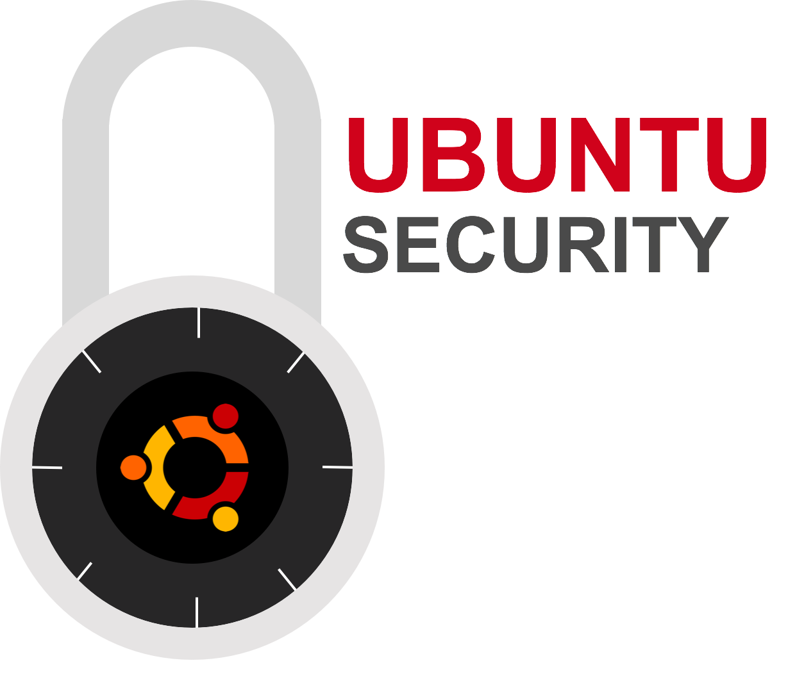

# SCRIPTS
some scripts to harden Ubuntu security. Also see it [here](https://mkaminsky11.github.io/scripts)

## INTRODUCTION

> #### WARNING!
> I am not responsible for ANYTHING that happens if you run this code. There could be bugs that delete stuff, mess things up, etc. I have tested this only on certain configurations. Also, if you get in trouble for using this, it's not my fault either. Tough beans for you.

These scripts are designed to improve the security of an Ubuntu machine. It is recommended that you run each command separately, rather than just `main.py`, because there is a lot of output, and seeing it all at once can be confusing.

## REQUIREMENTS
* Ubuntu (tested on 12.04 and 10)
* Python installed

## HOW TO USE
first, get everything you need
```shell
sudo apt-get install git #may be "git-core" for older systems
git clone https://github.com/mkaminsky11/scripts.git
cd scripts
```

you can just take the easy route with `main.py`. However, this will not run files like `remove_nfs.py`.
```shell
sudo python main.py #MUST be sudo!
```

or do it manually.
```shell
cd basic #or some other folder/python file
sudo python update.py #MUST be sudo!
```

## BASIC, CONFIG, etc.
The files are grouped into folders. Each of the files in these folders can be executed, so you can run whichever ones you need.

## LICENSE

> The MIT License (MIT)
>
> Copyright (c) 2015 Michael Kaminsky
>
> Permission is hereby granted, free of charge, to any person obtaining a copy
> of this software and associated documentation files (the "Software"), to deal
> in the Software without restriction, including without limitation the rights
> to use, copy, modify, merge, publish, distribute, sublicense, and/or sell
> copies of the Software, and to permit persons to whom the Software is
> furnished to do so, subject to the following conditions:
>
> The above copyright notice and this permission notice shall be included in
> all copies or substantial portions of the Software.
>
> THE SOFTWARE IS PROVIDED "AS IS", WITHOUT WARRANTY OF ANY KIND, EXPRESS OR
> IMPLIED, INCLUDING BUT NOT LIMITED TO THE WARRANTIES OF MERCHANTABILITY,
> FITNESS FOR A PARTICULAR PURPOSE AND NONINFRINGEMENT. IN NO EVENT SHALL THE
> AUTHORS OR COPYRIGHT HOLDERS BE LIABLE FOR ANY CLAIM, DAMAGES OR OTHER
> LIABILITY, WHETHER IN AN ACTION OF CONTRACT, TORT OR OTHERWISE, ARISING FROM,
> OUT OF OR IN CONNECTION WITH THE SOFTWARE OR THE USE OR OTHER DEALINGS IN
> THE SOFTWARE.
